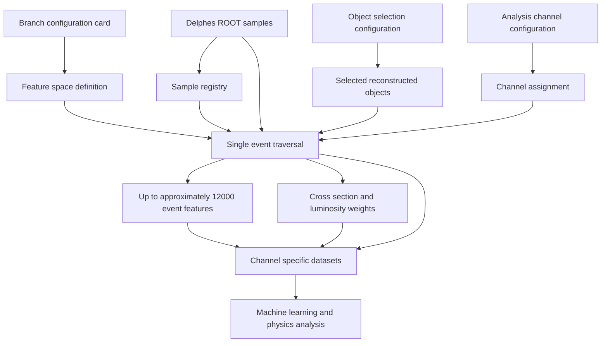
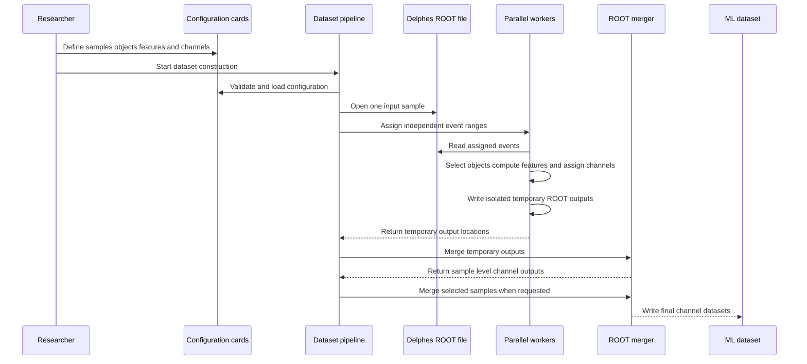
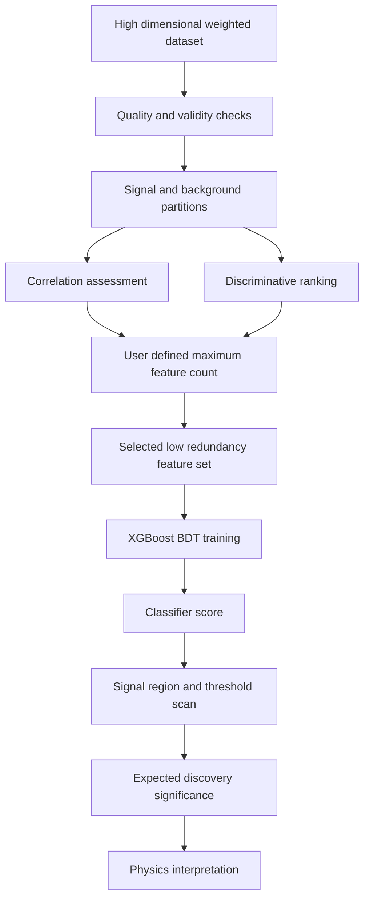

# Summary

The search for physics beyond the Standard Model at the Large Hadron Collider increasingly uses supervised and unsupervised machine learning to distinguish rare signal processes from substantially larger Standard Model backgrounds. Phenomenological studies commonly begin by generating Monte Carlo samples and then simulating the detector response with Delphes fast detector simulation [@delphes]. The expected input to the current HEPDataset workflow is therefore a ROOT file containing Delphes events. Such analyses require event level representations that preserve the information contained in reconstructed detector objects. The construction of these representations from Delphes output is often performed by an analysis specific event loop. This task requires repeated access to nested ROOT objects, object quality selection, kinematic feature construction, analysis channel classification, sample normalization, and output management. These responsibilities are closely coupled in many analysis scripts. The resulting workflow is time consuming to develop and difficult to audit for consistency.

HEPDataset is an open source software package that provides a configurable framework for reading Delphes ROOT files and producing machine learning ready event datasets. The package uses a branch configuration card named `branches_config.yml` to define the reconstructed objects, object representations, multiplicities, kinematic observables, event level quantities, and multi object combinations that should be extracted. A single configuration can request a high dimensional feature space containing up to approximately 12000 branches, subject to the available content of the input samples and the resources of the processing environment. The configuration therefore allows an analysis to preserve a broad description of each event before applying feature reduction or model specific selection.

The package performs object selection and analysis channel classification during the same event traversal that computes the requested features. It can therefore classify an event and populate all relevant output representations during one pass through the input file. This design avoids repeated reading of the same ROOT data when different channels or derived observables are required. The analysis channel description is configurable through `analysis_channels.py`. The object selection policy is configurable through `object_selection.py` and is intended to become more declarative through dedicated YAML cards in future releases. The current loop implementations use PyROOT to access the input ROOT files. Alternative loop implementations based on Uproot are planned so that the same dataset construction model can be used through a more Python oriented interface. These alternatives are complementary because Uproot is intended as another input backend rather than as a competitor to HEPDataset.

The workflow accepts collections of signal and background samples with their associated cross sections. It derives event weights using the generated event count, the process cross section, and the target integrated luminosity. It writes channel specific ROOT datasets and can merge outputs from different samples and processing chunks. Event processing is divided into independent ranges of the input event sequence. Each range is written to an isolated temporary output. The temporary outputs are then merged into the final dataset. This design permits parallel execution without concurrent writes to a common ROOT file.

HEPDataset is intended primarily to make the rapid generation of high dimensional machine learning datasets possible. The package can support conventional analysis workflows that use tabular classifiers and it can also support the future derivation of expected discovery significance for BSM signal hypotheses. Its principal goal is broader. It is intended to provide large and information rich event representations that can be supplied to advanced machine learning frameworks, including architectures based on attention and transformer mechanisms. Such models may benefit from access to thousands of correlated and complementary observables rather than to a small set of variables selected in advance by manual analysis practice.

# Statement of need

Delphes provides a widely used fast simulation of a generic collider detector [@delphes]. Phenomenological studies frequently use it after Monte Carlo event generation because it provides a computationally efficient approximation of the detector response. The current expected input to HEPDataset is a ROOT file produced by Delphes. Other detector simulation systems, including Geant4 and ATLASFast, can be supported in future releases provided that their event information is available in a compatible ROOT based representation. ROOT provides efficient storage and access to these data [@root]. The structure is appropriate for high energy physics analysis, but it is not directly equivalent to a machine learning table. The information for one event is distributed across object collections with event dependent multiplicity. A machine learning application generally requires a stable feature representation with explicit treatment of missing objects, object ordering, derived quantities, and event weights.

The direct construction of such a representation is time consuming because a researcher must repeatedly translate a physics definition into data access operations. Each new observable can require a new branch declaration, a new object traversal, a new convention for missing values, and a new validation procedure. The difficulty is not limited to the arithmetic of a kinematic variable. It also concerns the consistent treatment of object selection, combinatorial assignments, flavour categories, charge categories, signal regions, and sample normalization. When these responsibilities are implemented separately for multiple analyses, small inconsistencies can propagate into the training data and make comparisons between signal and background samples less reliable.

The direct approach is also vulnerable to avoidable errors. An analysis can accidentally read different object collections for different regions. It can calculate a variable only for some channels. It can apply incompatible selection criteria to signal and background samples. It can normalize samples using an incorrect event count or unit convention. It can read the same ROOT file several times because the output requirements for different regions were developed independently. These issues are particularly consequential for rare signal searches because a small selection or normalization discrepancy can alter the apparent separation between signal and background.

HEPDataset addresses this need by separating the definition of the desired physics representation from the repetitive mechanics of event processing. The `branches_config.yml` card provides a declarative description of the feature space. It can define reconstructed objects, their representations, the number of objects to retain, the kinematic quantities to derive, and the combinations of objects that should be considered. The card can therefore describe a feature space with up to approximately 12000 candidate features while retaining a single source of truth for the branch specification. The resulting representation can contain single object kinematics, multi object invariant quantities, angular correlations, missing transverse momentum observables, global activity variables, and event shape observables.

The feature space can include the kinematic content associated with reconstructed four vectors, including transverse momentum, pseudorapidity, azimuthal angle, invariant mass, energy, and the Cartesian momentum components. It can also include tracking and reconstruction parameters for leptons, jets, and fat jets whenever those quantities are available in the input ROOT branches. For pairwise and higher order combinations, the package can derive angular and transverse observables such as $\Delta R$, $\Delta\eta$, $\Delta\phi$, invariant mass, and $M_{T2}$, with $M_{T2}$ defined for the relevant two object and missing transverse momentum configuration. It can construct additional kinematic quantities from vector sums and scalar sums of object four vectors. Event level information can include missing transverse momentum, hadronic activity, lepton activity, total activity, effective mass, missing momentum significance, and the angular and kinematic properties of the missing momentum. Event shape observables such as centrality, circularity, aplanarity, and sphericity can be evaluated for the full event or for selected groups of reconstructed particles. These categories illustrate how one event can provide many single object features, an even larger set of pairwise and higher order features, and a broad collection of global event variables.

The current Python event loops use the PyROOT framework to read the ROOT files and access the Delphes event content. The package already provides alternative loop choices with different levels of explicitness and configurability. For example, a fixed loop can access a lepton transverse momentum through the direct attribute `lep.PT`, while the adaptive loop can obtain the same property through a configurable attribute lookup. This distinction allows the adaptive approach to expose a larger feature space through a compact configuration card. Future releases will add loop implementations based on Uproot, including counterparts analogous to `basic3_uproot.py` and `adaptive_uproot.py`. Uproot is not considered a competing package. It is a Python oriented ROOT input backend that can make the data access layer more independent of the ROOT runtime. The repository also contains C++ loop infrastructure intended for future serial and parallel ROOT processing. Each loop implementation is designed to accept a ROOT file path and return either channel keyed trees, a channel keyed dictionary of trees, or channel keyed paths to written ROOT files.

Future versions will also incorporate advanced learned taggers and related scoring models into the feature construction stage. Models in the ParticleNet family and comparable architectures can provide scores for b tagged, tau tagged, and c tagged jets. Dedicated models can also provide scores for QCD fat jets, W fat jets, Z fat jets, Higgs fat jets, and top fat jets. These scores can be recorded as additional event features alongside the conventional kinematic and reconstruction quantities. The intended objective is to read each ROOT event once and to produce a broad collection of complementary observables and learned object scores that are immediately available for downstream analysis.

The package also performs analysis channel selection during the event traversal. The same selected objects that provide the feature values determine the event category. This permits one pass through a ROOT file to produce the information required for multiple analysis channels. The approach is intended to be straightforward for researchers because changes to the feature space can be expressed through the configuration card rather than through a complete rewrite of the data extraction workflow. It is intended to be efficient because event access, selection, feature construction, and channel assignment are combined within one processing pass. It is intended to be extensible because the channel and object selection descriptions can evolve independently of the sample registry and the processing strategy.

The package is designed for analysis groups that need to construct datasets before a final machine learning architecture has been selected. A broad candidate feature space allows later studies to compare classical feature engineering with models that can learn representations from high dimensional inputs. The package therefore addresses a practical gap between detector simulation and advanced machine learning rather than replacing event generators, detector simulation software, recasting frameworks, or statistical inference tools.

The current workflow is summarized in Figure 1.

# State of the field

HEPDataset addresses the event representation stage of the analysis lifecycle. Its input is a ROOT file containing simulated or reconstructed events. The package can use PyROOT, Uproot, and, in future releases, C++ based event loops to traverse the input events and extract the requested information. Its target use case is the construction of event level datasets for an analysis that may use a multivariate classifier and whose feature space may evolve during the research process. The central output is not only a yield in a predefined signal region. It is a reproducible and weighted representation of many individual events with a large collection of physics motivated features. The event loop can be divided into independent ranges and executed in parallel before the resulting channel organized ROOT files are merged. This output can be used to train a BDT, a neural network, or a future architecture that learns from high dimensional event information.

The distinction is important for BSM searches. Recasting generally starts with an analysis whose object definitions and selection regions are already specified. Machine learning based analysis development can start earlier. The researcher may wish to retain a wide set of observables and determine through statistical learning which combinations contain useful information about a signal hypothesis. The researcher may also wish to compare several signal regions, mass points, background mixtures, and feature definitions without rebuilding the entire data production chain.

HEPDataset is therefore complementary to existing HEP software. It does not attempt to reproduce the detector simulation provided by Delphes. It does not attempt to replace the analysis validation and recasting capabilities of MadAnalysis 5, CheckMATE, or Rivet. It provides a configurable data preparation layer that can supply downstream machine learning frameworks and can later be connected to statistical tools such as pyhf [@pyhf].

The package is also complementary to generic machine learning libraries. XGBoost provides scalable gradient boosted decision trees [@xgboost]. HEPDataset does not provide a replacement for XGBoost. It provides a physics aware method for constructing the input representation that a classifier requires. Future integrations with attention based and transformer based architectures can extend this role to models that operate on high dimensional or structured event representations.

The following table summarizes the intended division of responsibility.

| Software layer | Primary responsibility | Role of HEPDataset |
| --- | --- | --- |
| Event generation | Production of hard scattering events and decays | External input |
| Detector simulation | Approximate detector response and reconstruction | External input from Delphes |
| Event dataset construction | Selection, feature extraction, weighting, and organization | Primary role |
| Machine learning | Classification, representation learning, and ranking | Downstream or planned integration |
| Statistical inference | Significance estimation and hypothesis testing | Downstream or planned integration |

# Software design

HEPDataset is designed around a separation between the physics description of the event representation and the operational process that constructs the dataset. The user specifies the desired objects, observables, channels, regions, and samples. The package then applies those definitions consistently while handling event traversal, weighting, parallel execution, temporary output, and merging. The loop interface is deliberately centered on the input ROOT file and the channel organized result. A loop can return in memory trees, a dictionary whose keys identify analysis channels, or paths to ROOT files that have already been written. This permits PyROOT based, future Uproot based, and future C++ based loop implementations to participate in the same higher level dataset workflow.

The branch configuration card is the main interface for defining the candidate feature space. It allows the user to express the physical content of the dataset without repeatedly modifying the event reading workflow. The card can request object level quantities and multi object quantities. It can also define the combinations of objects used for derived variables. This is important because many discriminative properties of collider events are relational. The invariant mass of two objects, their angular separation, and their transverse momentum balance can contain information that is not represented by the individual object values alone.

The package reads the selected event information and assigns an analysis channel during the same traversal. The channel representation can distinguish lepton multiplicity, lepton flavour, charge structure, and jet content. The configuration in `analysis_channels.py` allows the channel taxonomy to follow the needs of a particular physics analysis. The selection policy in `object_selection.py` provides the corresponding object quality requirements. Future releases will extend this configurability through dedicated YAML cards so that object definitions and selection criteria can be recorded as analysis data rather than only as program logic.

The single traversal design is motivated by both computational and scientific considerations. Repeated traversal of a large ROOT file increases input output cost and creates additional opportunities for inconsistent selection. A single traversal ensures that the features, event category, and event weight are derived from the same reconstructed event state. It also permits all requested channels to be produced from the same input pass. The approach is particularly valuable when the feature space contains thousands of candidate variables.

The processing strategy uses event range partitioning. A ROOT input file is divided into independent intervals of entries. Each worker receives one interval and produces isolated temporary outputs. The workers do not write to a common ROOT file. The resulting files are merged after the workers complete. The isolation of writes avoids concurrent access conflicts and makes the worker computation close to embarrassingly parallel. It also provides a clear failure boundary because a failed interval can be identified without corrupting a shared output file.

The merging strategy follows the structure of the physics output. Temporary files are first merged within a sample and channel or region. Sample level outputs can then be merged into final datasets for the corresponding channel or region. This hierarchy preserves the provenance of intermediate products while allowing the user to retain per sample outputs or create combined training datasets. Temporary files are removed after a successful merge so that the storage requirement does not grow with the number of processing intervals.

The complete current processing sequence is shown in Figure 2.

The design favors a transparent and configurable data production process over a fully automatic interpretation of physics intent. The package can calculate requested observables and apply requested selections. It cannot determine whether a particular selection is theoretically optimal or whether a variable is physically appropriate for a given search. That responsibility remains with the analysis team and requires validation against the detector card, the signal model, and independent physics calculations.

The package is intended to support two complementary modes of use. In the first mode, a researcher generates a broad dataset and supplies it to an external machine learning framework. In the second mode, a future integrated workflow selects a smaller set of informative features and trains a classifier within the same analysis environment. The second mode is planned rather than a claim about the complete current release.

Future development will introduce a discriminative feature selection stage. The user will be able to define a maximum number of retained features. The selection stage will seek features that provide strong discrimination between signal and background while controlling redundancy through an uncorrelatedness requirement. The purpose is to reduce the high dimensional candidate space to a compact representation that remains physically interpretable and computationally manageable.

The planned machine learning and significance workflow is shown in Figure 3.

This future stage will complement rather than replace the high dimensional dataset generator. The broad dataset remains the important scientific product because it permits the use of advanced learning systems that can discover nonlinear and higher order relationships among many observables. Feature reduction provides an optional route for interpretable BDT based studies and for applications where computational cost or systematic control favors a smaller representation.

# Research impact statement

HEPDataset is intended to reduce the time required to move from Delphes detector simulation to an analysis ready machine learning dataset. Its impact is therefore measured not only by the number of features or processed events. It is measured by whether analysis groups can construct, modify, validate, and compare event representations with less duplicated engineering effort.

The package can support searches for BSM physics in which the signal is distributed across several correlated kinematic properties. A conventional cut based analysis may use a small number of observables selected from prior physical intuition. HEPDataset permits the analyst to retain a substantially broader candidate space before the final classifier architecture or feature selection procedure is chosen. This is relevant for signals with complex decay chains, multiple production modes, compressed spectra, or experimentally overlapping final states.

The package also supports reproducible comparison between analyses. The branch configuration card records the requested feature space. The sample registry records the input processes and cross sections. The channel and object selection descriptions record the event categorization. Together these inputs provide a more explicit account of the data construction process than a collection of disconnected analysis scripts.

The planned feature selection and XGBoost integration will enable a complete exploratory workflow in which candidate variables are ranked, a BDT is trained, and the classifier score is used to estimate expected discovery significance for BSM signals. Such a workflow can help identify promising signal models and guide the design of later analysis selections. The significance estimate will remain dependent on the statistical model, systematic uncertainties, signal and background normalization, and assumptions about the dataset. It will therefore be an analysis aid rather than an automatic claim of discovery sensitivity.

The broader objective is to make the rapid generation of high dimensional event datasets routine. The resulting datasets can be supplied to advanced machine learning systems that exploit thousands of input features. Architectures based on attention and transformer mechanisms may learn relationships among event observables that are difficult to encode through manual feature selection. HEPDataset provides the data preparation foundation for these studies while preserving the possibility of using established classifiers such as XGBoost.

The software is intended for research use in collider phenomenology and machine learning based HEP analysis. Its outputs should be validated using independent physics calculations, controlled samples, closure tests, and systematic uncertainty studies before they are used for a physics claim. The project will benefit from future contributions that improve configuration validation, add dedicated selection cards, test serial and parallel equivalence, expand output format support, and connect the feature generation stage to modern high dimensional learning architectures.

# AI usage disclosure

Generative artificial intelligence was used to assist with the revision of this manuscript. The assistance was limited to restructuring prose, improving academic language, and organizing the description of the software according to the requested Journal of Open Source Software sections. The repository source files, configuration examples, existing manuscript, and stated software behavior were reviewed by the authors before the revised text was prepared. Claims concerning current functionality were constrained to behavior represented in the repository. Planned feature selection, classifier training, and discovery significance functionality are explicitly described as future developments rather than as capabilities of the current release. The authors remain responsible for the scientific accuracy, completeness, and final content of this manuscript.
